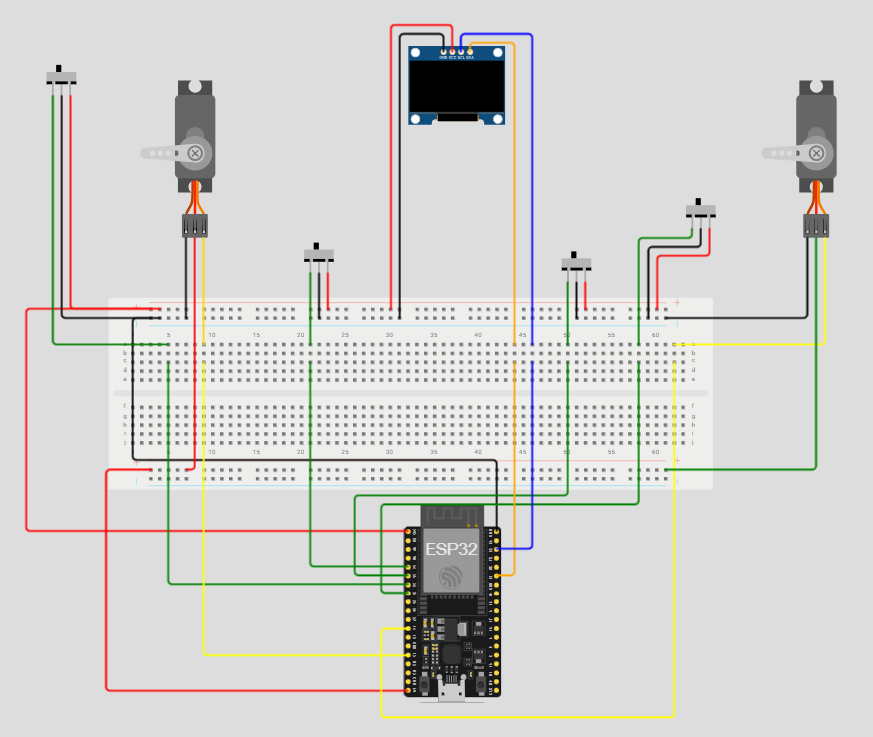

## 1. Danh sách linh kiện (Bill of Materials)
- **1x** Module ESP32 DOIT DevKit V1 (30 chân).
- **4x** Cảm biến vật cản hồng ngoại (IR Sensor).
- **2x** Động cơ Servo SG90.
- **1x** Màn hình OLED 0.96 inch (Giao tiếp I2C).
- **1x** Breadboard MB-102.
- Dây cắm Jumper (Đực-Cái, Đực-Đực).

## 3. Quy hoạch Nguồn điện (Power Management)
Việc phân chia nguồn điện là **bắt buộc** để tránh hiện tượng sụt áp khi Servo hoạt động làm reset ESP32.

* **Nguồn cấp chính:** Cổng USB (5V).
* **Quy hoạch Breadboard:**
  * `Dải nguồn Trái (5V)`: Chuyên dùng để cấp nguồn cho 2 động cơ Servo.
  * `Dải nguồn Phải (3.3V)`: Dùng để cấp nguồn cho 4 Cảm biến và Màn hình OLED.
* ⚠️ **Lưu ý an toàn (Common Ground):** Bắt buộc nối thông đường `GND (-)` của cả hai dải nguồn Trái và Phải lại với nhau để đồng bộ mức điện áp tham chiếu.

## 4. Bảng Nối Dây Chi Tiết (Wiring Table)

| Cụm chức năng | Linh kiện | Chân Linh Kiện | Chân ESP32 / Nguồn | Ghi chú |
| :--- | :--- | :--- | :--- | :--- |
| **Nguồn điện** | ESP32 | `VIN` | Dải Đỏ Trái (5V) | Nuôi Servo |
| | ESP32 | `3V3` | Dải Đỏ Phải (3.3V) | Nuôi Cảm biến & OLED |
| | ESP32 | `GND` | Cả 2 Dải Xanh (GND)| Nối chung Mass |
| **Cổng Vào** | IR 1 (Vào) | `OUT` | **D32** | Khai báo INPUT |
| | Servo 1 (Vào) | `Tín hiệu (Vàng)` | **D13** | Điều khiển PWM |
| **Cổng Ra** | IR 2 (Ra) | `OUT` | **D33** | Khai báo INPUT |
| | Servo 2 (Ra) | `Tín hiệu (Vàng)` | **D14** | Điều khiển PWM |
| **Bãi Đỗ** | IR 3 (Slot 1)| `OUT` | **D34** | Chân Input Only |
| | IR 4 (Slot 2)| `OUT` | **D35** | Chân Input Only |
| **Hiển Thị** | Màn hình OLED | `SDA` | **D21** | Chân I2C mặc định |
| | | `SCL` | **D22** | Chân I2C mặc định |

> **Ghi chú thêm:** Tất cả chân `VCC` của cảm biến nối dải **3.3V**, `VCC` của Servo nối dải **5V**. Chân `GND` của toàn bộ linh kiện nối vào dải **GND**.

